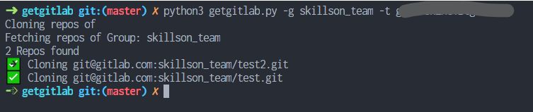

# Gitlab clone

Simple script to clone all gitlab projects



## Prerequisites

- Python3
- Pip

> `python` refers to Python and `python -m pip` refers to Pip. Consider changing if you have `python3` or `pip` or `pip3`

Download the dependencies:

```
python -m pip install -r requirements.txt
```

## Usage

Download the [script](getgitlab.py)

```
python getgitlab.py [-u USERNAME] [-g GROUP] -t TOKEN [-p] [--http]

# example
python getgitlab.py -u my_user -t sth -p # print all 
repos of my_user
python getgitlab.py --group my_group --token sth # clone all repos of my_group
```


|Option|Desc|
|--|--|
|`-u`, `--username` USERNAME |Gitlab user name|
|`-g`, `--group` GROUP |Gitlab group namm|
|`-t`, `--access-token` TOKEN |Your account [Personal access token](https://docs.gitlab.com/ee/user/profile/personal_access_tokens.html)|
|`--http` [Optional]|Use HTTPS repo links or `SSH` (For Https you need user pass each time)|
|`-p`,`--print` [Optional]| No cloning. Just print them|

## FAQ
**Stock at adding fingerprint and ...**: You may want to clone one repo manually and then try the script.
